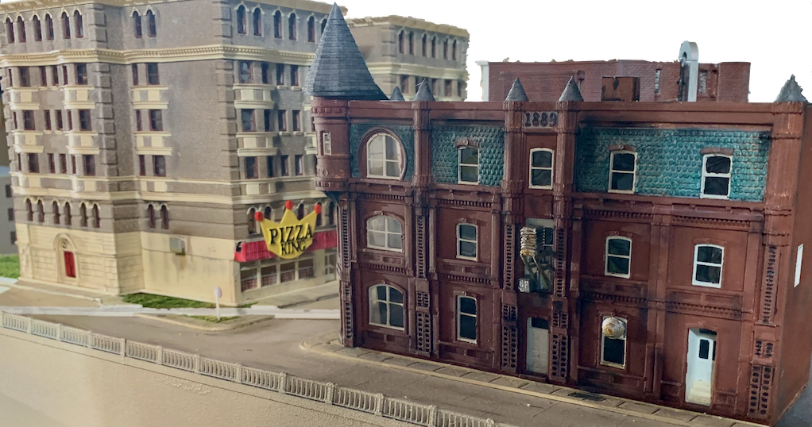
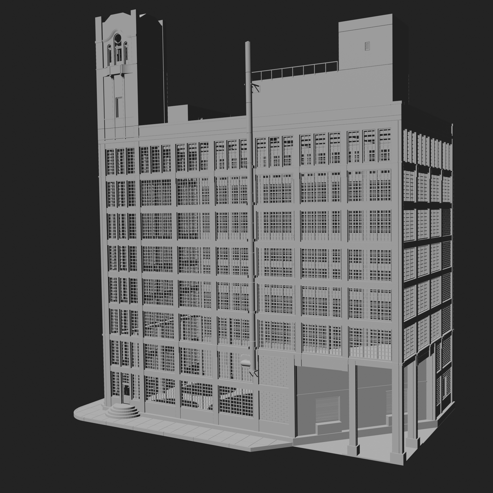

# N Scale Cleveland Flats

# [Wiki Page](https://github.com/nscale4by8/nscaleClevelandFlats/wiki)

The Wiki Page is a space for running commentary, documentation updates, announcements, and random thoughts. [The Wiki Page tends to be updated more often that the main web page. (click for more)](https://github.com/nscale4by8/nscaleClevelandFlats/wiki)

# [Structures](structures/structures.md) 
[(click for more)](structures/structures.md)

Prototype                           |   Model                   
:----------------------------------:|:----------------------------------:
 |  | 

# [Cuyahoga River Lift Bridges](./liftbridges/liftbridges.md) 
[(click for more)](./liftbridges/liftbridges.md)

Prototype                           |   Model                   
:----------------------------------:|:----------------------------------:
 |  | 
 | [More Information](./liftbridges/liftbridges.md)

# [Track Plan](trackPlan/trackPlan.md) 
[(click for more)](trackPlan/trackPlan.md)

Plan                                |   Overview                   
:----------------------------------:|:----------------------------------:
  |  | 
[Plan Including Annex](trackPlan/trackPlan.md) | [Annex in Foreground](trackPlan/trackPlan.md)

# [Benchwork](benchwork/benchwork.md)
[(click for more)](benchwork/benchwork.md)

# [Electronics](controls/controls.md)
[(click for more)](controls/controls.md)

# [Presentation About 3D Printing](3DPrintingForModelRailroading.key.pdf)
