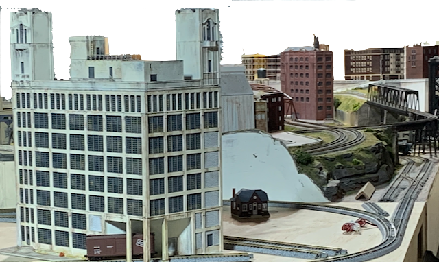
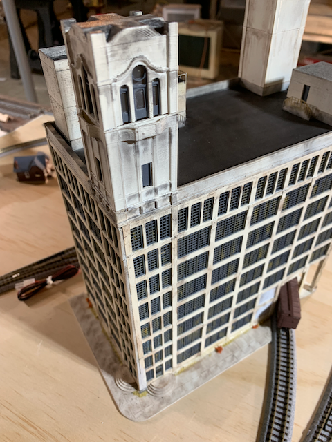
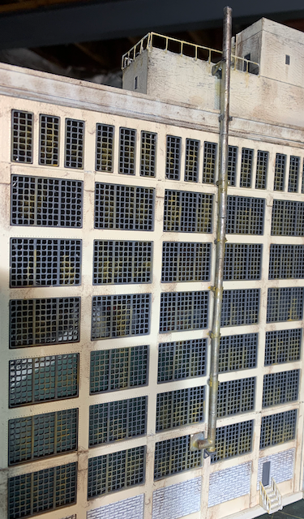
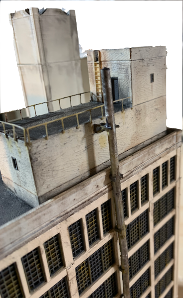
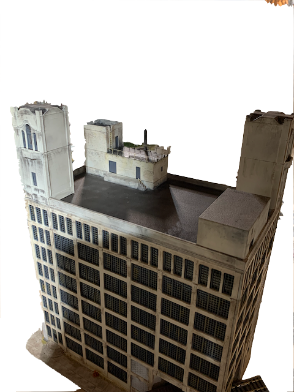
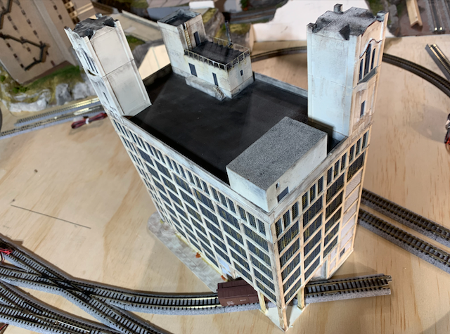
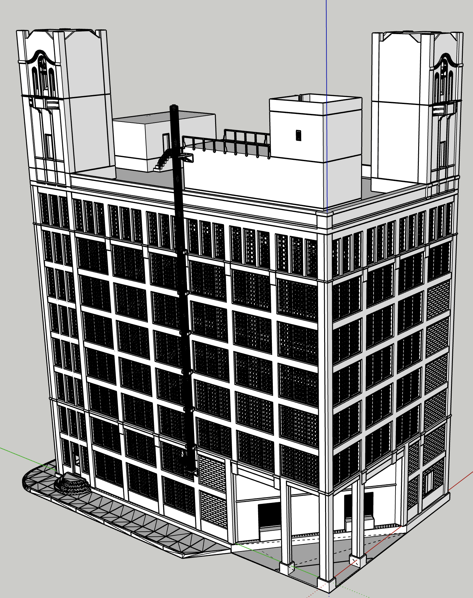

[Back](../structures.md)

# Crosley Building

Crosley Radio Corporation helped define the 20th century in Cincinnati. The Reds played in Crosley Field from 1912 until 1970.

The Crosley Building, built in 1929, housed the Crosley Radio Corporation and the first NBC Radio Station, WLW, which was once the most powerful station in the world with broadcast power sufficient for reception 1,000 miles away on a good day. Crosley expanded to manufacture automobiles and home appliances in the building. Reinforced concrete construction enabled giant windows to bathe open floors in natural light. Although vacant since the 1990s, the Crosley Building entered the National Register of Historic Places due to the building's' prominent roll in Cincinnati industry and innovative construction for its time. 

Even though the Crosley Building is hundreds of miles from the Cleveland Flats, it is a spiritual neighbor. It was a rail served industry incorporating street running and a corner "notch" where rail cars pass through. It fitls the "Annex" N-Track module's asthetic.

The prototype Crosley Building features one tower. The model has two towers for two reasons: 1) The model faces away from the front of the module, but the tower is its signature feature, so it is modelled with towers on front for accuracy and the back for visual appeal. 2) I glued the roof on 180 deg. wrong and didn't notice until after the glue set. My wife suggested adding the second tower to make the roof semetrical placing the second tower where the first should have been.

Rusty Stack         |   Details                  
:----------------------------------:|:----------------------------------:
 |  

Roof         |   Details                  
:----------------------------------:|:----------------------------------:
 |  |
 |

## Model

Creating the 3D model takes anywhere from dozens of hours to hundreds of hours. This one benefited from three complete restarts over almost a year.

[Back](../structures.md)
