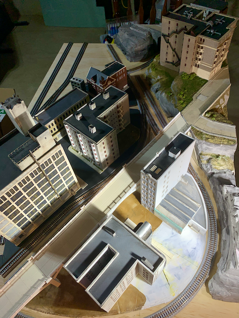
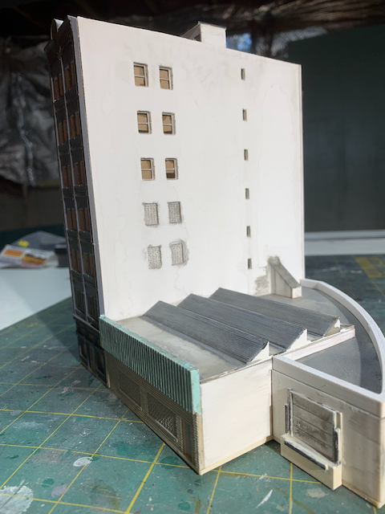
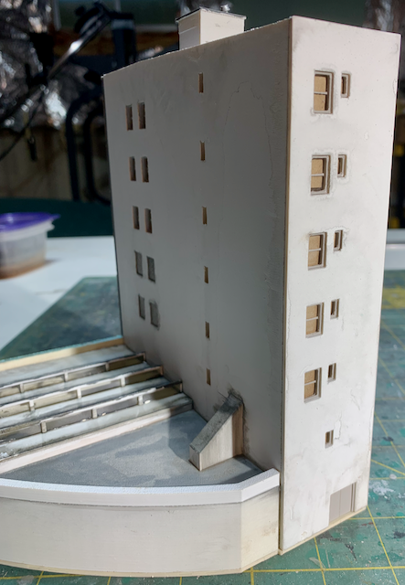
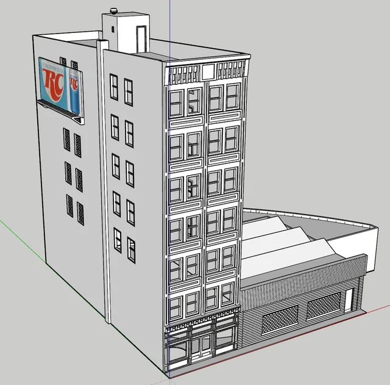
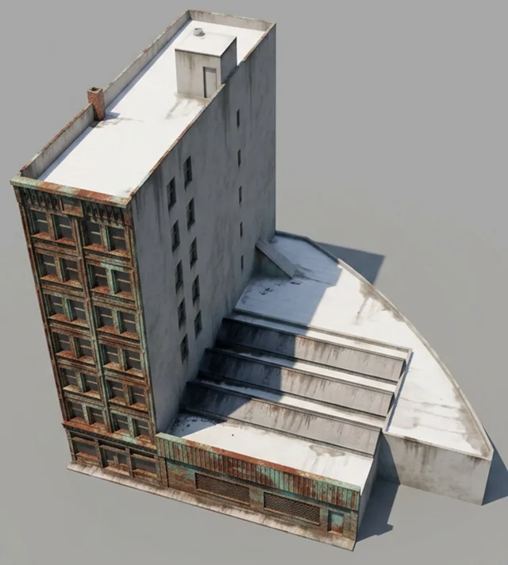
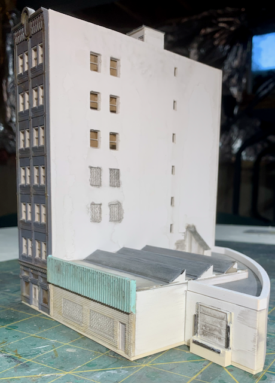
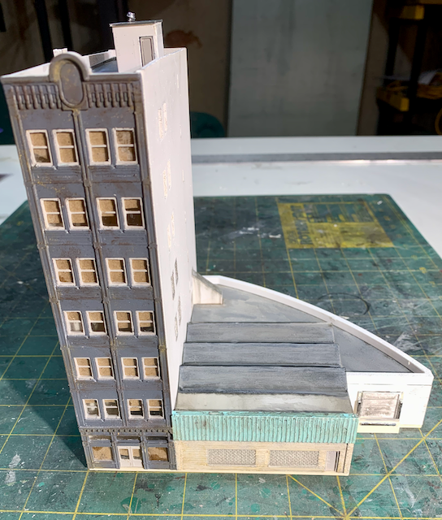
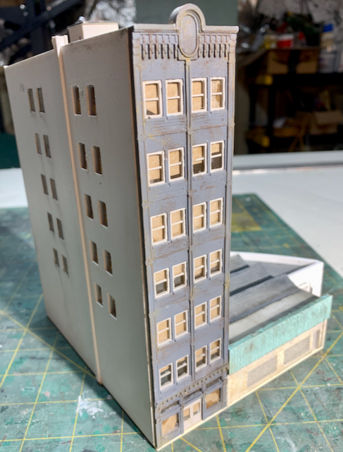
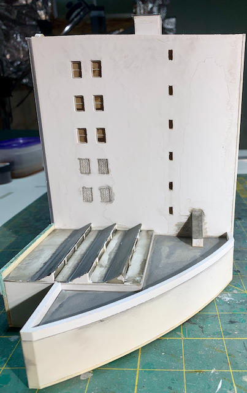
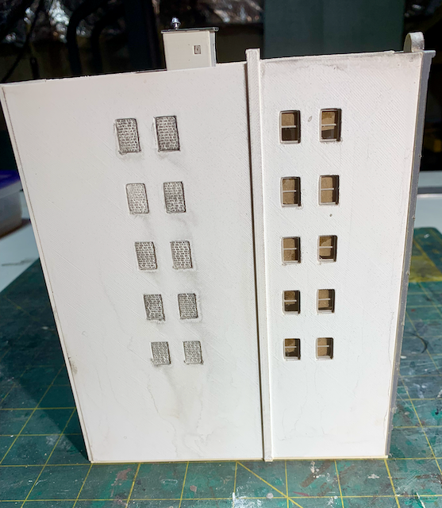

[Back](../structures.md)

# Curved Building

To further the quest of filling every inch of the module with urban squalor, a awkward spot required a curved structure. [Inspiration comes from the prototype.](https://www.google.com/maps/@39.1427322,-84.5397108,229m/data=!3m1!1e3?entry=ttu&g_ep=EgoyMDI2MDkzMC4wIKXMDSoASAFQAw%3D%3D)

On Module         |   Side       | Back                  
:------------:|:-------------:|:-------------------:
 |  | 

Model        |   AI Render       | Printed & Painted                  
:------------:|:-------------:|:-------------------:
 |  | 

Lots of work remains. There is a billboard already 3D printed and ready to attache to teh side of the structure as soon as the image for the billboard is selected. Sidewalks and streets come next.

## Gallary

[Back](../structures.md)
