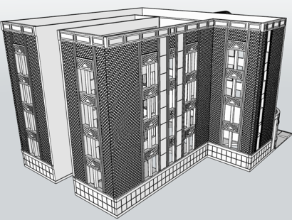
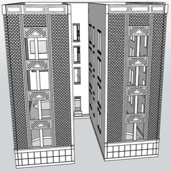
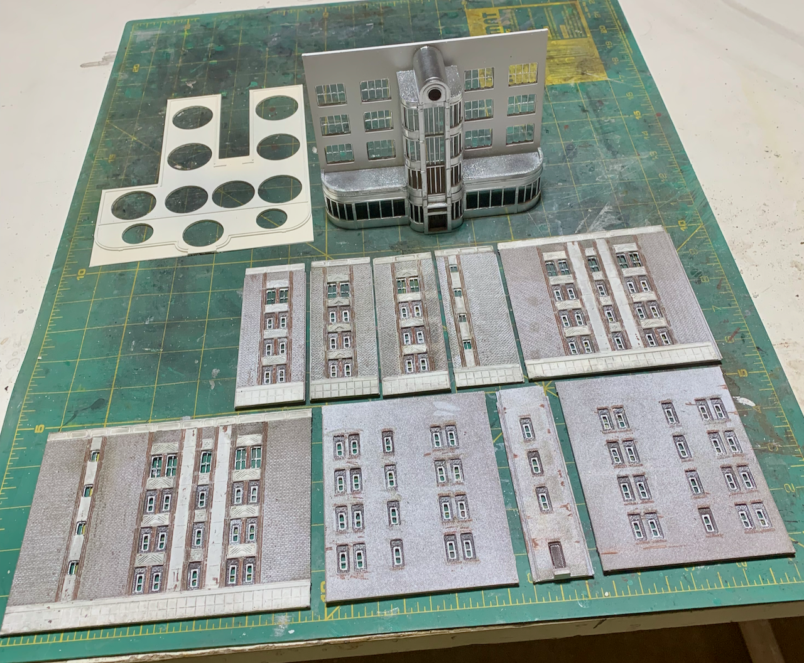
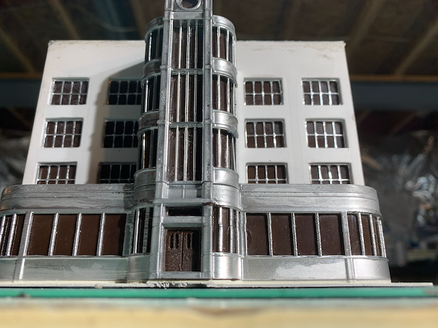
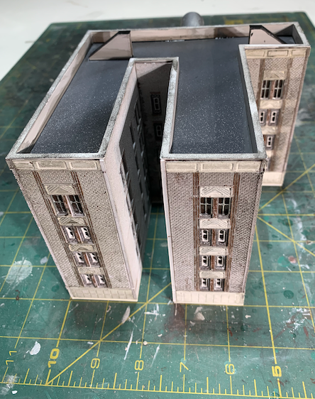
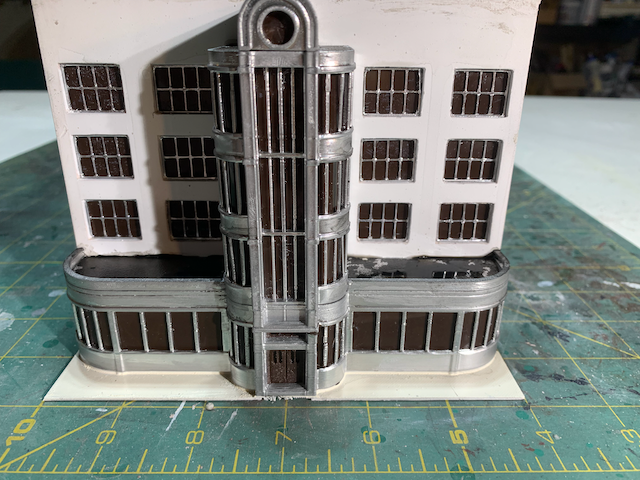
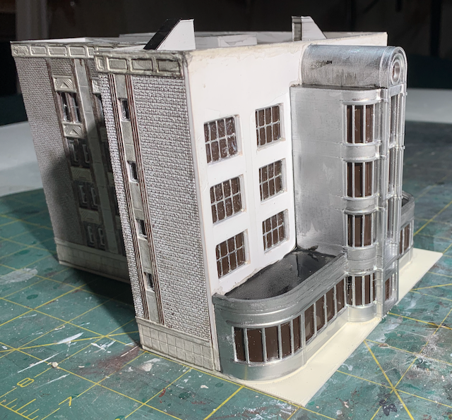

[Back](../structures.md)

# Art Deco Office Building

Front         |   Side       | Back                  
:------------:|:-------------:|:-------------------:
 |  | 

From the 1910s to the 1940s, Art Deco captured the imaginations of Architects and the public. The famous Cincinnati Union Terminal, the inspiration for the Justice League headquarters in comics, used concrete to create an imposing massive half dome.  The Chrysler Building in Manhattan uses aluminum or stainless steel to create a blazing sunburst facade.
 
Art Deco is typified by symmetry, curves, and "modern" materials like metal, ceramic, and cast concrete. Visual interest is enhanced by Moorish geometrical patterns often featuring sun bursts or chevrons. Aztec and Inca influences were also common.
 
An Art Deco office building provides visual interest at the front of the annex N-Track module. The following image shows the structure's parts are printed and panted:

 
In the 1970s, windows were often partially or completely bricked up in a futile attempt to save energy during the energy crisis. The front facade features aluminum or stainless steel. The brick walls are painted aged white with chips in paint exposing red brick and terracotta underneath. Once proud oversized windows reduced to slits match the pervading theme of the 1970s: malaise, decrepitude, and cultural rot.

 Front Elevation | Rear       | Sense of Mass                   
:------------:|:-------------:|:-------------------:
 |  | 
 | | 

## Brutalism (Successor to Art Deco)

The 1970s were a disaster for architecture. The Brutalist movement started in the 1940s and found financial backing in the 70s when ornamentation died on the alter of cheap construction. Extravagant old structures were demolished or renovated in ways that destroyed architectural interest. Large drafty windows were bricked up, boarded up, or replaced with cheap materials. If a structure could be considered remotely attractive, city authorities found reasons to condemn and demolish it. Winnipeg Canada is the poster city for Brutalism. The place looks like it was built by Soviets in Siberia as an attempt to destroy residents' will to live. Brutalists considered sunlight and widows distasteful and wasteful of energy. Take a look at [Winnipeg's pride](https://winnipegarchitecture.ca/digital-tours/brutalist/](https://www.exutopia.com/wonderful-winnipeg-brutalist-utopia/) and consider whether it is the set of a dystopian movie. I love the people of Winnipeg and Manitoba in general, but a wrecking ball could only improve the architecture.
