# N-Scale Globe Iron Building
## A Cleveland Flats Landmark
The Globe Iron building at 2325 Elm St. on the West Bank of Cleveland's Flats once served as the headquarters for the Globe Iron Works Corp. founded in 1853 to manufacture marine, stationary, portable, blowing and hoisting engines. The company soon produced narrow gauge locomotives, rolling mill machinery, boilers, tanks, stills, coarse sheet iron, and general castings. The actual smoke stack iron foundry sprawled along the banks of the Cuyahoga River. Over decades, several annexes and outbuildings expanded the space. By the 1950s, the headquarters building served primarily as a warehouse. In 2023, the historic structure re-opened as a live music venue seating 1200.

| Prototype                 | Model                     |
|:-------------------------:|:-------------------------:|
|    |       |

This model celebrates the prototype structure while incorporating some creative license. The model a four story building. The prototype has three floors. Selective compression honors the prototype while conceding to space and practical limitations.

The model footprint is 3 7/8 inches by 5 inches and sits near the center of the [N-Track module I am building](../../benchwork/benchwork.md).

| Prototype               | Model                     |
|:-----------------------:|:-------------------------:|
| 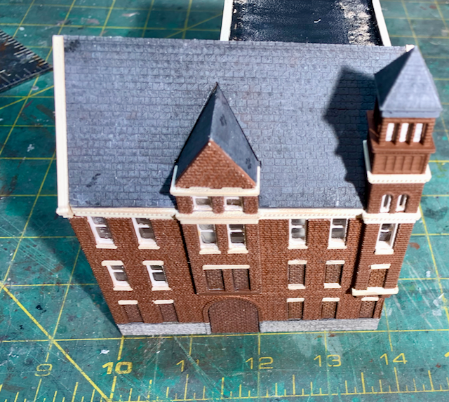    | 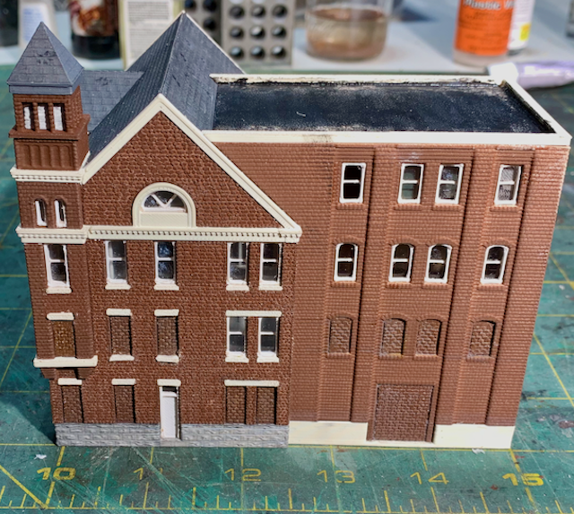      |
| 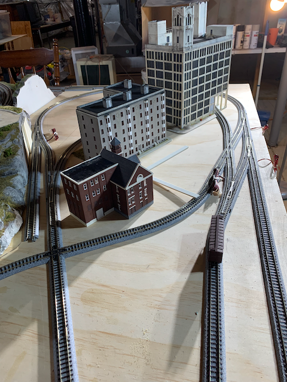    | 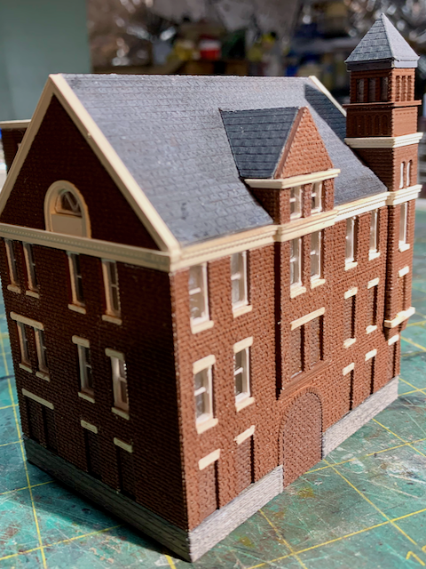      |
| 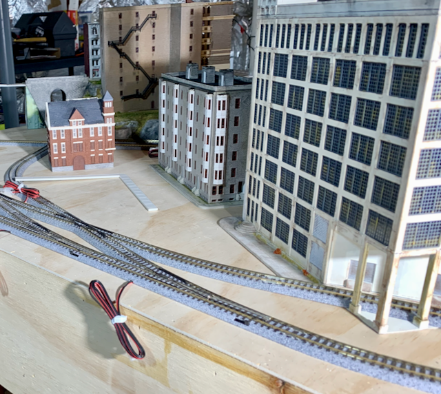    |       |

I tried several techniques that are new to me and even started writing assembly instructions with the goal of one day selling kits for this structure.

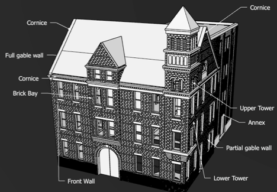

PArts that should be painted separately are printed separately. Windows and other components are printed in "blocks" to reduce the total number of parts and simplify assembly.

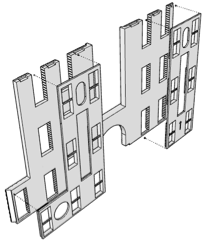 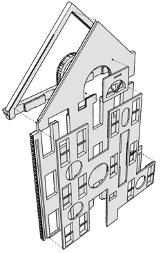

|            |                                                       |
|:----------:|:-----------------------------------------------------:|
|The bricks of the partial gable wall below the tower should overlap the bricks of the front wall. The beveled edges that meet below the tower should be flush and conceal any seams between bricks at the corner. There should be a subtle snapping into place as the interlocking angles of the partial gable wall and the front wall meet. | 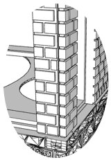                                                                                                                                                                                                                    |
| 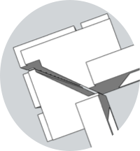 | **Design Note:** The diagonal surfaces where walls join are keyed so the join should not slide when parts are pressed together. The parts interlock with tight tolerances to help assure a clean aligned corner that minimizes visibility of seams.                            |

All components provide "tabs" and "slots" that align the parts and prevent assembly in any other way.

## Part Cleanup

The 3D printed parts are generally ready to be assembled, but occasional printing artifacts may need to be cleaned up using a sharp hobby knife. A small file may be used to smooth edges.

If there are small surface textures, grooves, or imperfections in PLA parts, apply a thin layer of nail polish. Nail polish is a weak solvent for PLA and naturally fills tiny grooves. Once the nail polish has dried, it may be painted the same way as the rest of the parts.

## Painting

Paint the parts prior to assembly. Use any acrylic paint. PLA plastic resists some oil based paints. For example, Krylon brand spray paint may peel away from the PLA parts, but Rust‐Oleum brand spray paints generally work. (Krylon and Rust‐Oleum are registered trademarks of their respective manufacturers.)

## Glue

Styrene solvents do not generally work well with PLA plastic.  However, several brands of plastic glue contain more than one solvent, and some of the component solvents may bond PLA. Cyanoacrylate Adhesives commonly called “Super Glue” always work with PLA. Cyanoacrylate can be messy and will glue flesh together almost instantly. Cyanoacrylate adhesives are used for wound closure in some surgeries. Use the glue sparingly, and keep the glue away from your fingers and eyes. A little goes a long way. In most cases, a single small drop is sufficient to bond parts together.

## Assembly

The parts are designed to fit together in only one orientation. In cases where the correct orientation is not obvious, parts feature tiny inscribed arrows pointing up or toward the front of the model. When pressing parts together, if the fit is uneven (loose at one end and too tight at the other), verify that the parts have the correct orientation. In some cases, window openings are smaller at the top of the building than at the bottom to match the prototype.

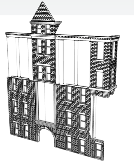 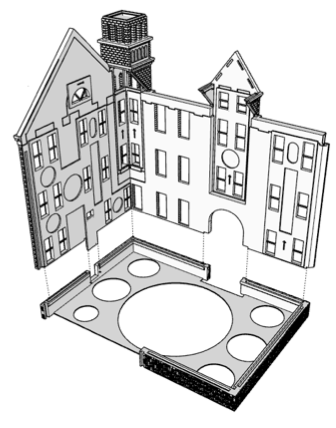 

**Caution:** Some parts will not interlock together if assembled and glued in a different order than shown in the instructions. One part may cover a channel or tab that mates with another part. When assembled in the order, the tabs and channels are not covered until after the mating parts have been joined.
