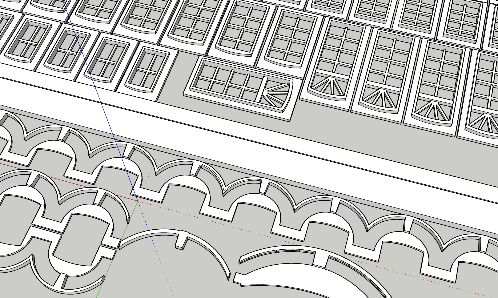
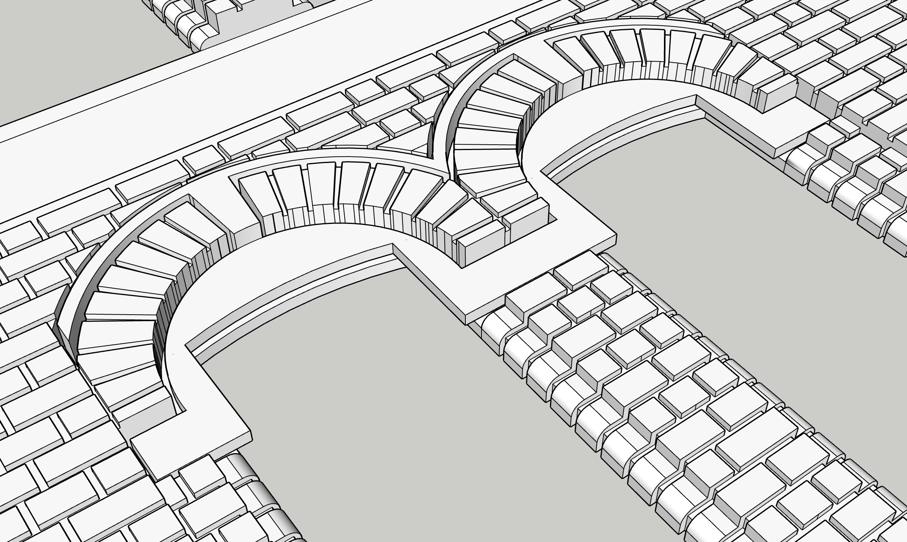

[Back](../structures.md)

# International Brotherhood of Electrical Workers (IBEW)

This structure is based on a United Steel Worker's building in Pittsburgh.

## Details of Bricks, Trim,, and Windows

  

[Back](../structures.md)

