[Back](../structures.md)

# N-Scale Strand Apartments

Life is beak when you're stranded in the tenements. The Strand public housing represented a step up.

## "Golden Age" of Public Housing

There were two "golden" ages of public housing in Cleveland. The first occurred around 1900 when the city experienced general overcrowding from rapid population growth, immigration, and the great migration of African Americans. Six to eight story brick "palaces" replaced whole blocks of crumbling 19th century wooden row houses. The new apartment buildings improved overall housing conditions and were popular among working class and some middle class families. Locations featured street car service, nearby employers, a multitude of shops, and neighborhood parks. The buildings were racially integrated in that era. Irish, Italian, German, and Polish accents mixed with African American idiomatic speech could be heard in every corridor. Cosmopolitan neighborhoods were likely nobody's goal. Wealthier neighborhoods like Shaker Heights had explicit race covenants that excluded people. No better place existed or tolerated the newcomers. People packed together out of necessity.

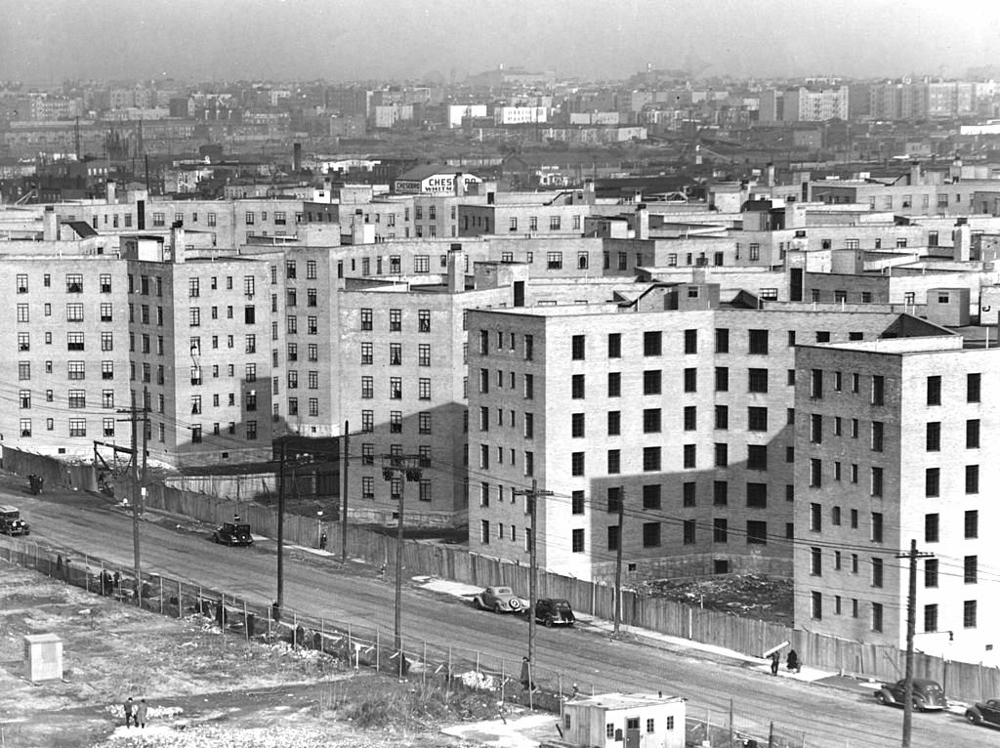

Residents soon migrated to suburbs and self-segregated along ethnic and racial lines. The Cleveland suburb, Parma, became "Big Italy" in contrast to the smaller East Side neighborhood called "Little Italy". Soon, Polish immigrants replaced the Italians. You can still buy Polska Kielbasa in any Parma grocery store even though few native Polish speakers remain.

A second wave of public housing emerged to house almost destitute families in the 1930s Great Depression. The truly destitute became homeless in hobo camps and Hoovervilles. Owners of "luxury" apartment buildings built during the 1920s were forced to lower rents. They couldn't squeeze blood from a stone. Landlords catered to working families who paid at least token rent. These landlords tended to enforce strict racial and ethnic segregation.

## Inspiration from David K. Smith

David K. Smith's ["Jersey City Industrial Railroad"](http://www.davidksmith.com/modeling/layouts/JerseyCityIndustrial/jcir-3.htm) inspired my N-track module. His prototype includes ["Pacific Avenue Apartments"](http://www.davidksmith.com/modeling/layouts/JerseyCityIndustrial/jcir-3-4.htm)

I model the late 1970s and designed Strand Apts. to represent a 1920s "luxury" building for the middle class that now caters to economically stressed residents. When built, zoning didn't exist, and the location right next to industrial employers appealed the original tenants.

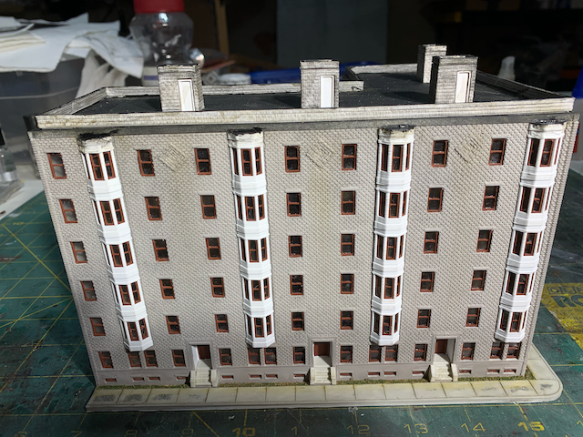

The prototype Strand Apts. are several miles from the Cleveland Flats Industrial District. Land in the heart of the Flats was at various times too valuable for residential use. There is precedent though: "Whisky Island" is a one mile square peninsula in the Flats. There is debate about how the name, Whisky Island, originated: The best theory is an ethnic stereotype that Irish residents of the peninsula loved their whisky. The peninsula likely contained the first European settlement in Cleveland, but that's also uncertain.

Whisky Island was a residential neighborhood throughout the nineteenth century. The Irish moved up hill to Ohio City or up river to the [Irishtown Bend](https://www.flickr.com/photos/timevanson/39972995074) which is the exact location I model. In my universe, Irishtown Bend retained some of its residents as industrial land use gradually supplanted the housing. In my universe, one of the last blocks of row houses survived until the 1920s when they were razed to build Strand Apts.

### Irishtown Bend
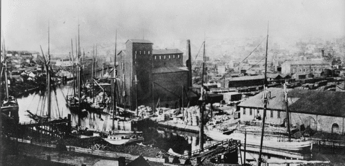

| SketchUp Model             | Printed Model            |
|:-------------------------:|:-------------------------:|
|  |      |

## Fire Escapes

I love fire escapes. They provide visual interest to the backs of structures. They can look complex like spider webs of iron.

For some reason, people online keep telling me that 3D printed fire escapes are not possible in N Scale. I disagree. Many of my structures incorporate fire escapes, and others have open tread stairs. I'm mystified why people think it isn't possible.

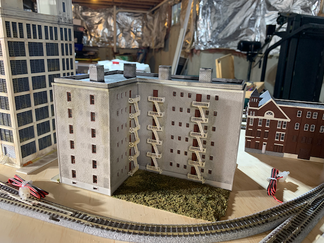

Strand Apt. uses "New York" style fire escapes, but other structures I've designed use other types.

### Parts Ready To Print

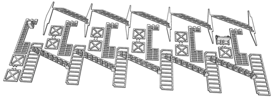

### Parts As Assembled

Note how all the parts interlock so they can only be assembled one way. This also provides extra surface area for glue.

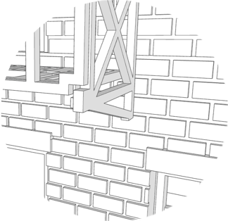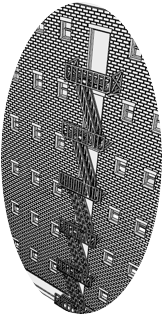
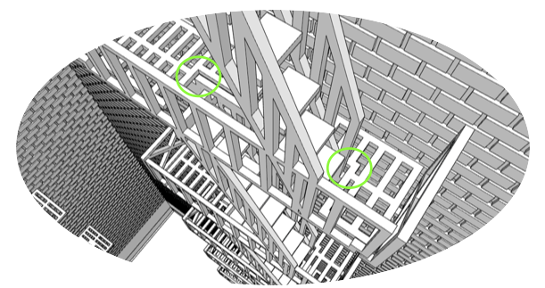

## Gallery

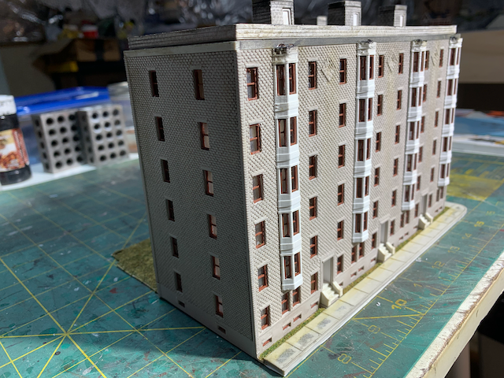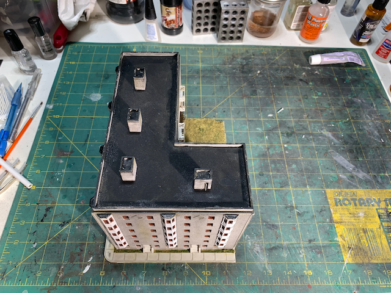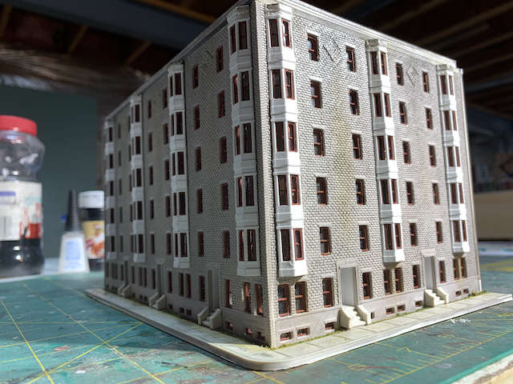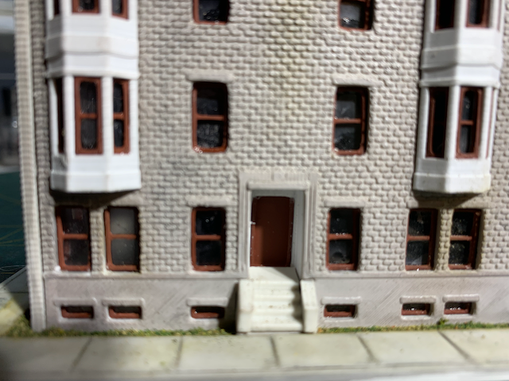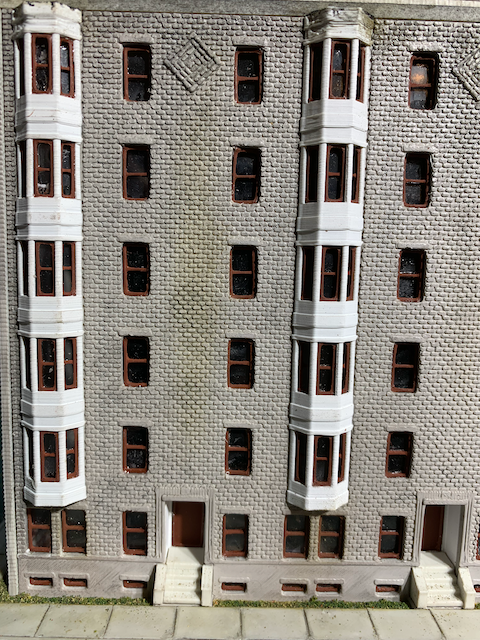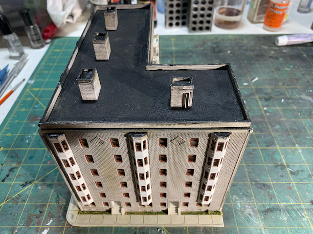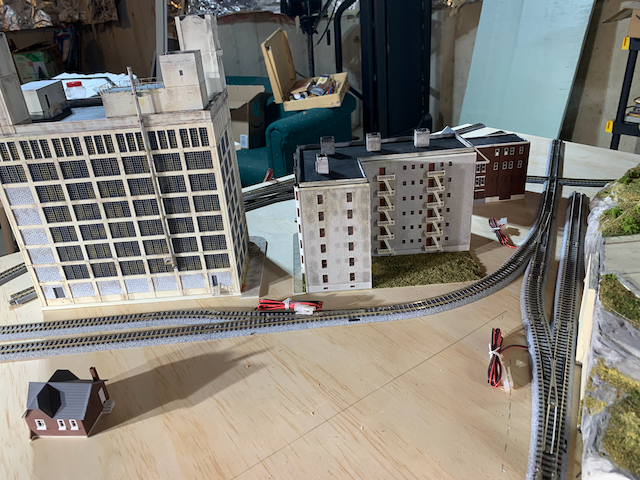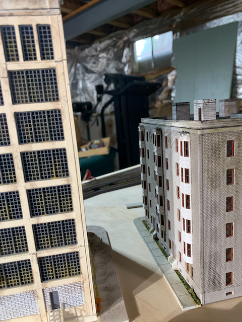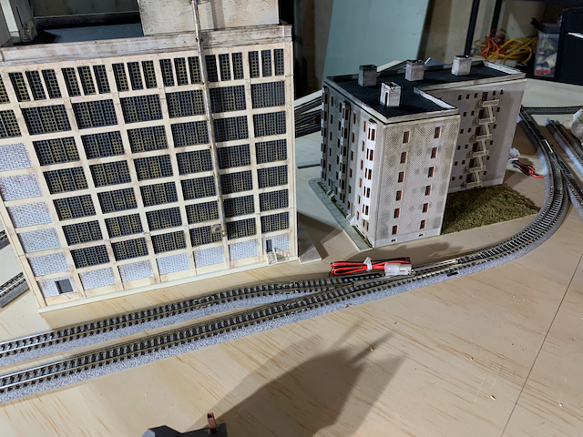

[Back](../structures.md)
